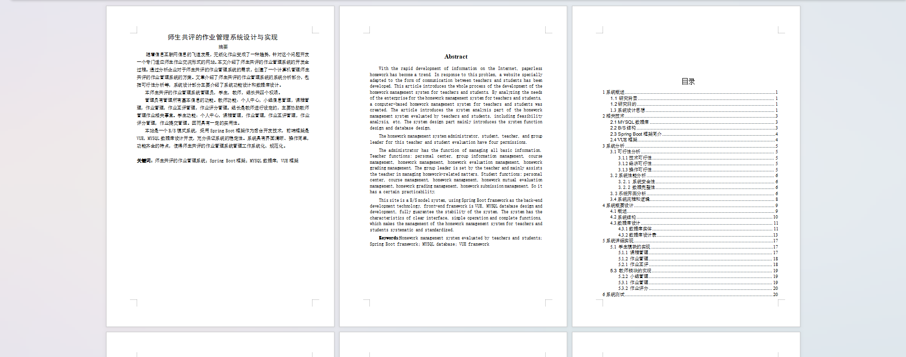
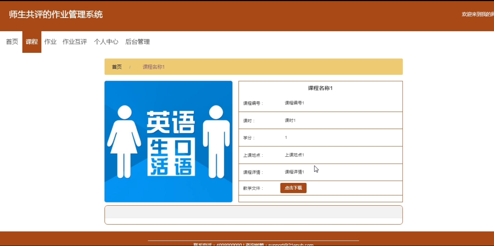
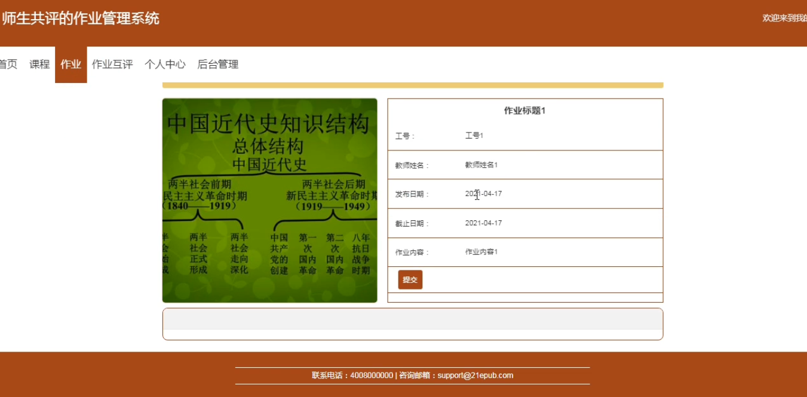
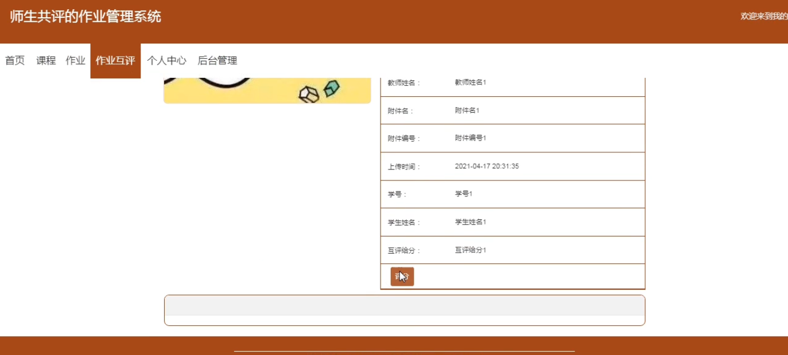
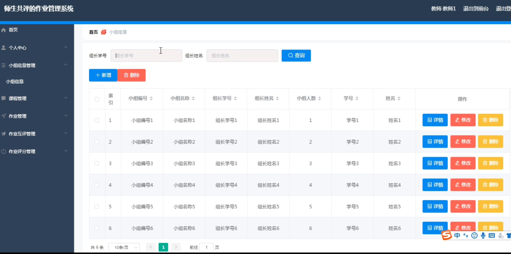
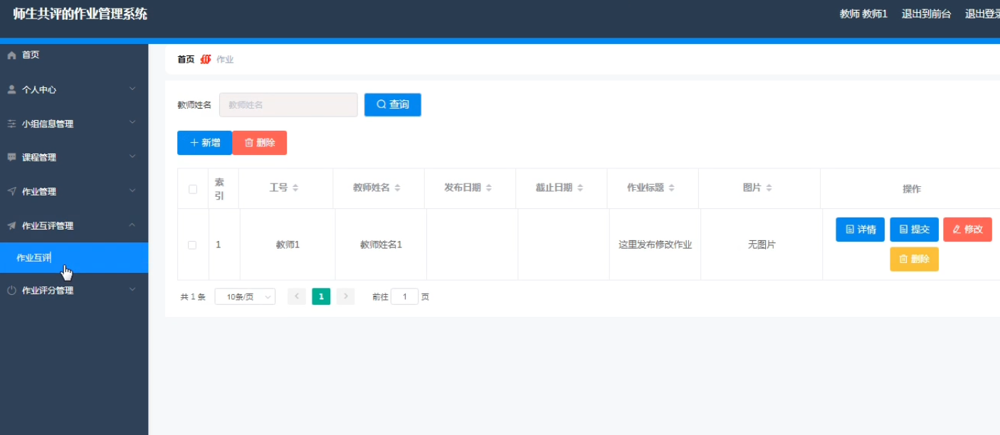
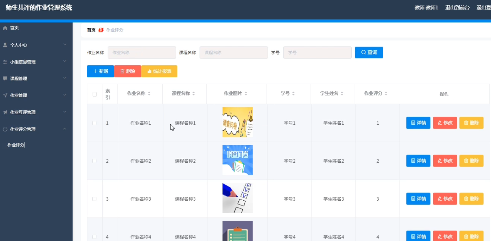

基于Springboot的师生共评的作业管理系统（程序+论文）
=
### 完整代码获取地址：从戎源码网 ([https://armycodes.com/](https://armycodes.com/))
### 作者微信：19941326836  QQ：952045282 
### 承接计算机毕业设计、Java毕业设计、Python毕业设计、深度学习、机器学习
### 选题+开题报告+任务书+程序定制+安装调试+论文+答辩ppt 一条龙服务
### 所有选题地址https://github.com/nature924/allProject

一、项目介绍
---
系统包含两种角色：用户、管理员，系统分为前台和后台两大模块，主要功能如下：

### 1 学生模块的实现
- 课程管理: 学生可以在前台首页查看课程信息，并进行下载操作。
- 作业管理: 学生登录后可以在作业栏目查看并提交作业，提交操作需登录。
- 作业互评: 学生登录后可以查看他人的作业并进行评价。

### 2教师模块的实现
- 小组管理: 教师登录后可以管理小组信息，包括添加、修改和删除操作。
- 作业管理: 教师登录后可以对作业信息进行添加、修改和删除操作。
- 作业评分: 教师登录后可以对作业进行评分，包括添加、修改和删除操作。

二、项目技术
---
- 编程语言：Java
- 数据库：MySQL
- 项目管理工具：Maven
- 前端技术：VUE、HTML、Jquery、Bootstrap
- 后端技术：Spring、SpringMVC、MyBatis

三、运行环境
---
- 操作系统：Windows、macOS都可以
- JDK版本：JDK1.8以上都可以
- 开发工具：IDEA、Ecplise、Myecplise都可以
- 数据库: MySQL5.7以上都可以
- Tomcat：任意版本都可以
- Maven：任意版本都可以

四、运行截图
---
### 论文截图：

### 程序截图：

